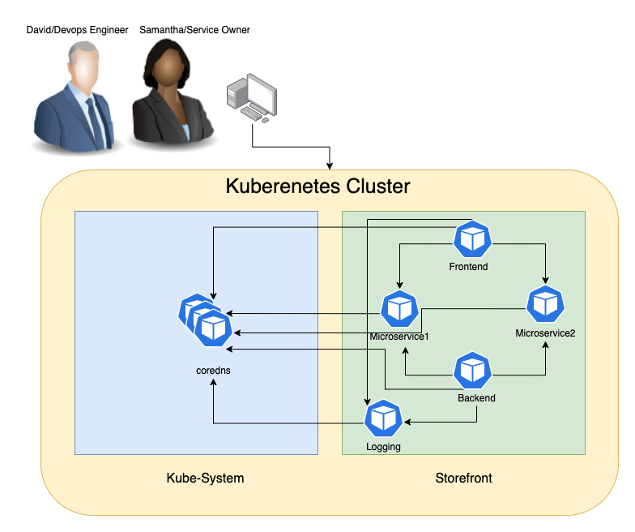
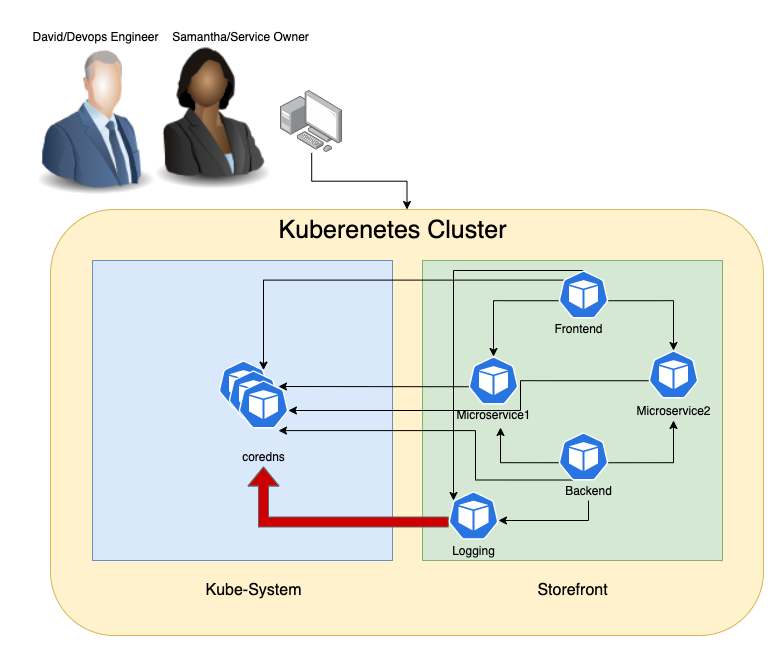
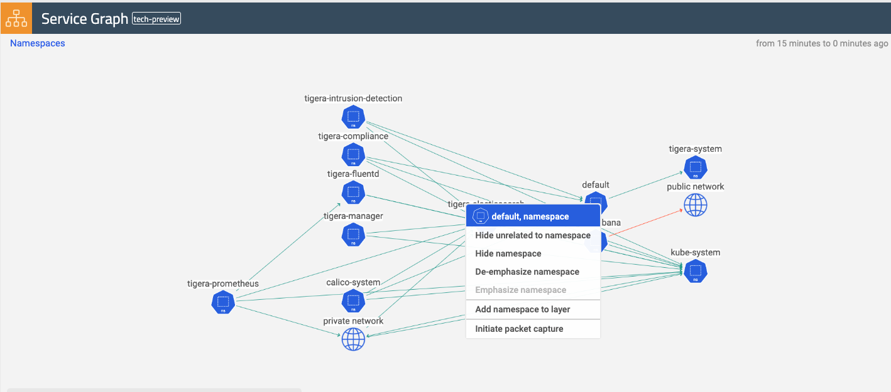
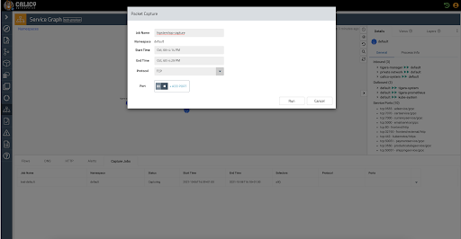
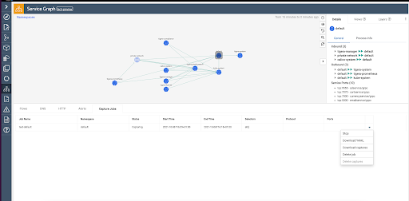

# PacketCapture-using-Calico

## Use Case
Story:
DevOps, Plateform Teams (David, Paul) are trying to figure out what’s wrong with DNS service as it has seen DNS service degradation several times during the past few days.



Teams notice that a few minutes before every outage there has been a massive amount of requests in addition to packet retransmission coming from the logging pod in the storefront namespace.




Why is this happening? The Level-1/Level-2 troubleshooting hasn't provided much context and information to root cause the problem. 

Challenges:
The issue happens over the night when no one from the storefront service owners (Samantha) is present to do live troubleshooting. Further, David and Samantha don’t have full access to storefront namespace and cannot run packet capture on this pod.

Requirements:
David needs to get access to run Dynamic Packet Capture job in storefront namespace to capture the problem on the CoreDNS and to retrieve the captured files.
Only David and Samantha should be able to retrieve these files and review.
Additional filtration is required to do specific capture for faster and targetted review and avoid running out of space to capture the relevant information.

Solution:
With CE 3.8 David and Samantha can be given access to specific namespace or pod based on RBAC. They can run specific packet capture job doesn’t and only retrieve the associated captured files. Further no one else has access to these files.
With CE 3.9 David and Samantha can define the job for targeted capture based on ports, protocols, ingress/egress.


## Preparing the environment 

1- Deploy storefront namespace and logging application

```bash
kubectl create ns storefront
kubectl  run logging -n storefront --image=nginx -l app=logging
kubectl exec -it logging -n storefront -- bash 
apt update 
apt install iputils-ping
```

2- Creat SA called David 

```bash
kubectl create sa david-sa -n storefront
```

3- create kubeconfig file for David

```bash
# Update these to match your environment
SERVICE_ACCOUNT_NAME=david-sa
CONTEXT=$(kubectl config current-context)
NAMESPACE=storefront

NEW_CONTEXT=david-sa
KUBECONFIG_FILE="kubeconfig-sa"

TOKEN=$(kubectl get secret -n storefront $(kubectl get serviceaccount david-sa -n storefront -o jsonpath='{range .secrets[*]}{.name}{"\n"}{end}' | grep token) -o go-template='{{.data.token | base64decode}}')

# Create dedicated kubeconfig
# Create a full copy
kubectl config view --raw > ${KUBECONFIG_FILE}.full.tmp
# Switch working context to correct context
kubectl --kubeconfig ${KUBECONFIG_FILE}.full.tmp config use-context ${CONTEXT}
# Minify
kubectl --kubeconfig ${KUBECONFIG_FILE}.full.tmp \
  config view --flatten --minify > ${KUBECONFIG_FILE}.tmp
# Rename context
kubectl config --kubeconfig ${KUBECONFIG_FILE}.tmp \
  rename-context ${CONTEXT} ${NEW_CONTEXT}
# Create token user
kubectl config --kubeconfig ${KUBECONFIG_FILE}.tmp \
  set-credentials ${CONTEXT}-${NAMESPACE}-token-user \
  --token ${TOKEN}
# Set context to use token user
kubectl config --kubeconfig ${KUBECONFIG_FILE}.tmp \
  set-context ${NEW_CONTEXT} --user ${CONTEXT}-${NAMESPACE}-token-user
# Set context to correct namespace
kubectl config --kubeconfig ${KUBECONFIG_FILE}.tmp \
  set-context ${NEW_CONTEXT} --namespace ${NAMESPACE}
# Flatten/minify kubeconfig
kubectl config --kubeconfig ${KUBECONFIG_FILE}.tmp \
  view --flatten --minify > ${KUBECONFIG_FILE}
# Remove tmp
rm ${KUBECONFIG_FILE}.full.tmp
rm ${KUBECONFIG_FILE}.tmp
 ```


## Packet capture configureations

1- create yaml file to capture the traffic over port 53 from pod logging in storefront namespace 

```bash
cat << EOF >> pc-storefront-logging-dns.yaml
apiVersion: projectcalico.org/v3
kind: PacketCapture
metadata:
  name: pc-storefront-logging-dns
  namespace: storefront
spec:
  selector: app == "logging"
  filters:
    - protocol: UDP
      ports:
        - 53
EOF
```

2- Enforce RBAC for packet capture 

Allow user David to create/delete/get/list/update/watch packet captures for storefront namespace

```bash
cat <<EOF| kubectl apply -f -
apiVersion: rbac.authorization.k8s.io/v1
kind: Role
metadata:
  namespace: storefront
  name: tigera-packet-capture-role
rules:
- apiGroups: ["projectcalico.org"]
  resources: ["packetcaptures"]
  verbs: ["get", "list", "watch", "create", "update", "patch", "delete"]
---
apiVersion: rbac.authorization.k8s.io/v1
kind: RoleBinding
metadata:
  name: tigera-packet-capture-role-David
  namespace: storefront
subjects:
- kind: ServiceAccount
  name: david-sa
  namespace: storefront
roleRef:
  kind: Role
  name: tigera-packet-capture-role
  apiGroup: rbac.authorization.k8s.io
EOF
```

3- switch users and use david ServiceAccount to apply the packet capture yaml file 

```bash
kubectl apply -f PC-storefront-logging-DNS.yaml
```

4- trigger any DNS traffice from the logging pod

```bash
kubectl exec -it -n storefront logging -- sh -c "ping google.com"
```


5 - validate that David can't retrieve 

```bash
# in my lab I am already have a Loadbalancer to expose the cluster over port 9443 so I don't need to create a port forward
kubectl port-forward -n tigera-manager service/tigera-manager 9443:9443 &
# Update these to match your environment
NS=<REPLACE_WITH_PACKETCAPTURE_NS>
NAME=<REPLACE_WITH_PACKETCAPTURE_NAME>
TOKEN=<REPLACE_WITH_YOUR_TOKEN>
curl "https://localhost:9443/packet-capture/download/$NS/$NAME/files.zip" -L -O -k \
-H "Authorization: Bearer $TOKEN" -vvv
```

we should get 403 https response, The client does not have access rights to the content, so the server is refusing to give the requested resource.


```bash
< HTTP/2 403
< content-type: text/plain; charset=utf-8
< date: Mon, 23 Aug 2021 12:54:28 GMT
< x-content-type-options: nosniff
< content-length: 62
```

also if you check the logs of the tigera-packetcapture pod you should see "user does not have RBAC permissions" message

```bash
kubectl logs -n tigera-packetcapture $(kubectl get pods -n tigera-packetcapture -o jsonpath='{.items[0].metadata.name}')
```

> 2021-08-23 12:53:12.046 [ERROR][1] auth.go 51: failed to authenticate user error=user does not have RBAC permissions for authenticationreviews


## Retriving PCAP file


1- In order to allow user jane to access the capture files generated for a specific namespace, a role/role binding similar to the one below can be used:

```bash
cat <<EOF| kubectl apply -f -
apiVersion: rbac.authorization.k8s.io/v1
kind: ClusterRole
metadata:
  name: tigera-authentication-clusterrole-David
rules:
- apiGroups: ["projectcalico.org"]
  resources: ["authenticationreviews"]
  verbs: ["create"]
---
apiVersion: rbac.authorization.k8s.io/v1
kind: ClusterRoleBinding
metadata:
  name: tigera-authentication-clusterrolebinding-David
roleRef:
  apiGroup: rbac.authorization.k8s.io
  kind: ClusterRole
  name: tigera-authentication-clusterrole-David
subjects:
- kind: ServiceAccount
  name: david-sa
  namespace: storefront
---
apiVersion: rbac.authorization.k8s.io/v1
kind: Role
metadata:
  namespace: storefront
  name: tigera-capture-files-role
rules:
- apiGroups: ["projectcalico.org"]
  resources: ["packetcaptures/files"]
  verbs: ["get"]
---
apiVersion: rbac.authorization.k8s.io/v1
kind: RoleBinding
metadata:
  name: tigera-capture-files-role-David
  namespace: storefront
subjects:
- kind: ServiceAccount
  name: david-sa
  namespace: storefront
roleRef:
  kind: Role
  name: tigera-capture-files-role
  apiGroup: rbac.authorization.k8s.io
EOF
```

3- retrieve the files

```bash
# in my lab I am already have a Loadbalancer to expose the cluster over port 9443 so I don't need to create a port forward
kubectl port-forward -n tigera-manager service/tigera-manager 9443:9443 &
# Update these to match your environment
NS=<REPLACE_WITH_PACKETCAPTURE_NS>
NAME=<REPLACE_WITH_PACKETCAPTURE_NAME>
TOKEN=<REPLACE_WITH_YOUR_TOKEN>
curl "https://localhost:9443/packet-capture/download/$NS/$NAME/files.zip" -L -O -k \
-H "Authorization: Bearer $TOKEN" -vvv
```

4- Once you retrive the generated pcap files using the right account you can see that we only captured the UDP/53 traffic 

```bash
unzip files.zip
% sudo tcpdump -ttttnnr  logging_eni00ad604076b.pcap
reading from file logging_eni00ad604076b.pcap, link-type EN10MB (Ethernet)
2021-08-17 10:37:35.287477 IP 192.168.24.180.51326 > 10.100.0.10.53: 41554+ A? google.com.storefront.svc.cluster.local. (57)
2021-08-17 10:37:35.287874 IP 192.168.24.180.51326 > 10.100.0.10.53: 35934+ AAAA? google.com.storefront.svc.cluster.local. (57)
2021-08-17 10:37:35.288080 IP 10.100.0.10.53 > 192.168.24.180.51326: 41554 NXDomain*- 0/1/0 (150)
2021-08-17 10:37:35.288227 IP 10.100.0.10.53 > 192.168.24.180.51326: 35934 NXDomain*- 0/1/0 (150)
2021-08-17 10:37:35.288294 IP 192.168.24.180.37628 > 10.100.0.10.53: 32284+ A? google.com.svc.cluster.local. (46)
2021-08-17 10:37:35.288342 IP 192.168.24.180.37628 > 10.100.0.10.53: 53282+ AAAA? google.com.svc.cluster.local. (46)
2021-08-17 10:37:35.288699 IP 10.100.0.10.53 > 192.168.24.180.37628: 32284 NXDomain*- 0/1/0 (139)
2021-08-17 10:37:35.288770 IP 10.100.0.10.53 > 192.168.24.180.37628: 53282 NXDomain*- 0/1/0 (139)
2021-08-17 10:37:35.288828 IP 192.168.24.180.55617 > 10.100.0.10.53: 41638+ A? google.com.cluster.local. (42)
2021-08-17 10:37:35.288858 IP 192.168.24.180.55617 > 10.100.0.10.53: 32427+ AAAA? google.com.cluster.local. (42)
2021-08-17 10:37:35.289107 IP 10.100.0.10.53 > 192.168.24.180.55617: 32427 NXDomain*- 0/1/0 (135)
2021-08-17 10:37:35.289169 IP 10.100.0.10.53 > 192.168.24.180.55617: 41638 NXDomain*- 0/1/0 (135)
2021-08-17 10:37:35.289214 IP 192.168.24.180.38939 > 10.100.0.10.53: 38437+ A? google.com.us-west-2.compute.internal. (55)
```

5- finally you can stop the packet catture 

```bash
kubectl delete -f pc-storefront-logging-dns.yaml
```
## CE 3.10 Dynamic Packet Capture Enhancements

Ability to access PC via service graph UI
Ability to rerun/stop a capture job, retrieve and delete capture files, view YAML files and delete a capture job from the UI
Ability to schedule packet capture

From the service graph view, right-click a namespace, and you can schedule a capture job that selects all workload endpoints within that particular namespace.






